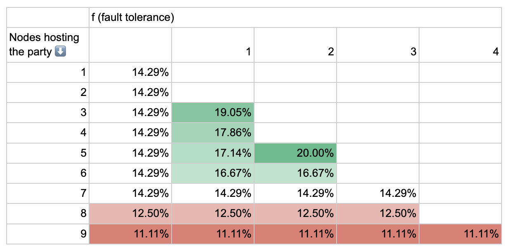
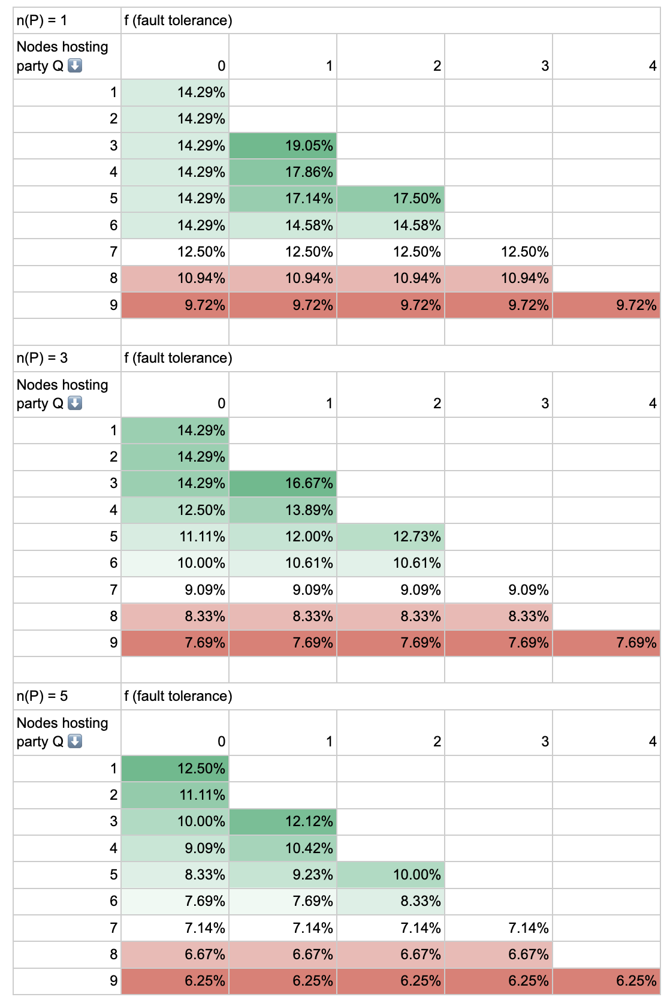
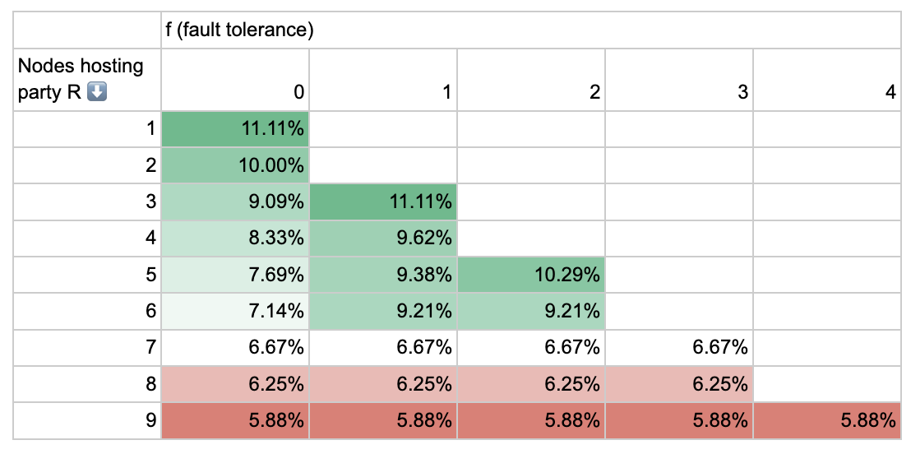
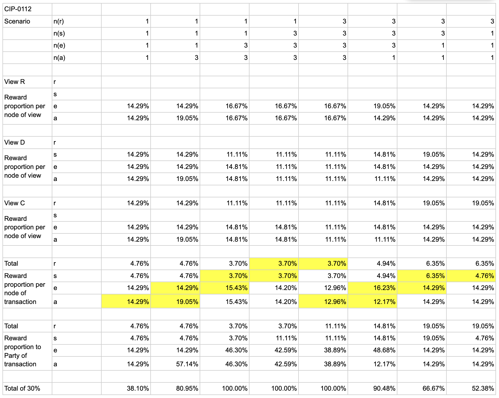

## CIP: Traffic-Based Validator Rewards and Confirming Validator Incentives

<pre>
  CIP: CIP-0120
  Title: Traffic-Based Validator Rewards and Confirming Validator Incentives
  Author: David Richards, Simon Meier and Bernhard Elsner
  Status: Proposed
  Type: Tokenomics
  Category: Tokenomics
  Created: 2026-06-29
  License: CC0-1.0
</pre>

# Abstract

This proposal changes the calculation of validator rewards to be based on actual traffic usage rather than CC burn for traffic purchases, similar to the changes made for application rewards in [CIP-0104](https://github.com/canton-foundation/cips/blob/main/cip-0104/cip-0104.md). It introduces a reward split between the submitting validator and confirming validators. By reallocating a portion of the validator rewards to confirming validators, this CIP incentivizes the multi-hosting of parties across validators, enhancing network security and decentralization.

# Motivation

Currently, users earn validator rewards based on the Canton Coin (CC) burned as part of a traffic purchase. Although the burning of CC for traffic is logically tied to the usage of traffic, this model can create a disconnect, as the user burning the CC and receiving rewards can be different from the validator receiving and processing the traffic. Determining validator rewards based on actual traffic spend is a more accurate way to reward validators for enabling network activity.

Decentralized hosting of parties across multiple independent validators improves the security and availability resiliency of those parties. However, the current validator rewards model does not reward validators for hosting parties unless transactions get submitted through the node itself. Thus there is no economic incentive for validator operators to offer hosting services that only confirm transactions and thus provide decentralization. This CIP proposes to create this incentive by allocating some validator rewards to confirming validators, while ensuring that the submitting validators—who perform the heavy lifting of user acquisition and providing ledger API access—receive the majority of the validator rewards.

# Specification

## High-Level Specification

### Reward Triggers

Validator reward weights must be calculated based on the transactions that spend traffic, not the transaction that purchases the traffic. Analogously to CIP-0104, the validator reward weighting must be determined by the total traffic cost, envelope sizes, and mediator data of all transactions successfully committed on the Global Synchronizer.

### Reward Weight Allocation

For each transaction, the calculated validator reward weighting must be separated into two shares:

* **Submitting Validator Share:** 70%
* **Confirmating Validators Share:** 30%

This split must be stored as a DSO configuration parameter that can be changed by Super Validator voting. The confirmation validator share must be divided based on the envelope size among all confirming validators (including the submitting validator).

### Decentralization Parameters

The distribution of the confirmation validator share must incentivize party hosting topologies where most parties are hosted on at least three validator nodes out of which two must confirm. Thereby ensuring that one compromised validator node can be tolerated both for integrity and availability of that party.

The parameters determining the targeted decentralization must be DSO configuration parameters that can be changed by Super Validator voting.

### Beneficiary Party Support

Validator rewards must be shareable with up to 20 beneficiary parties, so that validator node operators can distribute rewards to their business stakeholders.

### Ignore Rejected Transactions

Transactions that fail confirmation or are otherwise rejected by the network still consume traffic, meaning the submitting and confirming validators still expend computational resources. The sequencer will continue to charge the submitting validator node for this traffic cost, ensuring it serves as an effective Denial-of-Service (DoS) protection measure. However, to prevent malicious actors from spamming the network with intentionally flawed transactions to harvest inflated rewards, rejected transactions do not qualify for any validator rewards. Only successful confirmation requests must generate validator activity records.

### Ignore Transactions Submitted by SV Nodes

SV Nodes do not need to burn CC to purchase traffic. Their transaction submissions thus do not contribute CC burn. To avoid skewing the burn-mint-equilibrium, transactions submitted by SV nodes must thus not create any validator activity records, neither for them as the submitter nor for the confirming validator nodes.

### Minting and Reward Sharing Automation

The minting and reward sharing of traffic-based validator rewards must work [analogous to traffic-based app rewards](https://docs.canton.network/global-synchronizer/splice-fundamentals/reward-sharing): using either CIP-0073 Minting Delegations or the built in automation in a validator node.

### Adjusting Validator Caps for High-Burn Environments

During periods of high network activity where the Burn-Mint Equilibrium (BME) ratio exceeds 1.1, validators hit their 20% validatorRewardCap. To offset the reduction in submitting validator rewards and ensure fair validator compensation during traffic spikes, this CIP proposes increasing the standard validator dynamic minting cap from 20% to 30% of the maximum round allowance. This provides validators with the necessary headroom to access unminted CC supply during high-burn rounds, ensuring their rewards scale appropriately with their actual workload. This adjustment does not alter the baseline 18% target allocation, nor does it reduce the caps of Application Providers or Super Validators.

## Technical Specification

### Principles

The idea is to follow the CIP-0104 model of calculating *activity records* measured in bytes for each validator involved in the transaction. To do this, we follow three core principles:

**Principle 1 (Transaction Isolation).** The activity records of all nodes involved in a transaction of size b, may sum up to at most b. This ensures that odd behaviour in one transaction cannot impact the rewards of another transaction.

**Principle 2 (View Isolation).** The activity records are calculated per transaction view based on view sizes in bytes and then summed up over views, splitting transaction overhead pro-rata. This ensures that odd behaviour in one view can only impact how the transaction overhead is split. All nodes are guaranteed predictable minimum activity records for their views.

**Principle 3 (Party Isolation).** The bytes for each view are split between confirming parties before splitting them amongst nodes. This ensures that in a multi-party view an enormously decentralized party cannot take nearly all the rewards.

To incentivise the decentralization of rewards we follow the next three principles:

**Principle 4 (Fault Tolerance Incentives).** An m-of-n hosted party has availability fault tolerance f\_a \= n-m and integrity fault tolerance f\_i \= m-1. Overall fault tolerance is f \= min(f\_a, f\_i) based on which optimal configurations can be tabulated:

f=0: 1-of-1
f=1: 2-of-3
f=2: 3-of-5
f=3: 4-of-7
…

Incentivizing fault tolerance means that a node confirming a party with fault tolerance f=0 should get less than a node confirming a party with f=1, which should get less than a node confirming a party with fault tolerance f=2, etc.

**Motivating Example.** Principle 4 is impossible in its pure form. To incentivize decentralization without causing infinite reward dilution, we must define the point where adding more nodes to a party stops being profitable. In a scenario where a single party hosted on a single node confirms a transaction, that party receives a share `r` of the 30% confirmation rewards. If that party is instead decentralized across `k` nodes, the pool is shared among them, providing each node with at most 30% / `k`. By selecting `r` (the single-node share), we define a threshold: once the number of nodes `k` exceeds 30% / `r`, the reward per node falls below the original single-node share. By choosing `r`, we therefore explicitly set the point of diminishing returns, establishing the economic boundary where decentralization incentives end. Hence the need for principle 5\.

**Principle 5 (Capped Fault Tolerance Incentives).** There is a maximum level of incentivized fault tolerance after which adding extra nodes to a party starts diluting the nodes share of the confirmation rewards.

**Principle 6 (Capped per Node Rewards).** A single node confirming multiple parties in the same view earns rewards only for the *most decentralized* party that it confirms. For example, in the motivating example, the single node N should not be able to earn more than r by adding a second party to the same view confirmed only by N.

### New Configuration Parameters

Extend the `AmuletConfig.rewardConfig` with these fields:

* `confirmingValidatorRewardPercentage (c)`: specifies the share of the validator rewards distributed among the confirming validators (default value `0.3`)
* `maximumDecentralizationValue (d)`: the number of nodes hosting a single party P at or above which no decentralization incentives are possible. Explained differently, 1/r of the motivating example above. (default `7`)

### Validator Activity Record Computation

Decentralization incentives and caps (principles 4 and 5\) are expressed per party (P) (principle 3). To calculate these, first we get the node count and confirmation threshold for each party:

* **node count** n(P) \= number of nodes hosting a party in confirming mode
* **confirmation threshold** m(P) \= \# nodes that must confirm any transaction for that party

Using those, we can calculate the fault tolerance, and using that the per-party party weight:

* **fault tolerance** f(P) \= min(m(P)-1, n(P)-m(P))
* **party weight** w(P) \= min(1, (n(P) \+ f(P)) / d)

We can then divide the party weight equally between the nodes confirming for that party to get the per-node party weight:

* **per-node party weight** wn(P) \= w(P) / n(P)

Considering principle 6 where a node confirming multiple parties in the same view only earns rewards only for the most decentralized party that it confirms, we need to get the highest per-node party weight of the parties that node hosts in that view:

* **node view weight** w(N, V) \= max\_{P confirms V, N hosts P} wn(P)

Considering Principle 1, where the activity records of a transaction cannot sum to more than the size of the transaction, we must ensure that total attribution per node does not exceed the view’s available reward share. For this reason, we normalize each node's decentralization weight by the total sum of all weights in that view. This weight also acts as a cap by limiting the denominator of the attribution at 1:

* **node view attribution** a(N, V) \= w(N, V) / max (1, sum\_M w(M, V))

Finally, for a transaction TX of size b bytes composed of multiple views V\_i, we aggregate the node's individual view attributions to determine the total transaction attribution. In alignment with Principles 1 and 2, we calculate this by scaling the node's contribution pro-rata based on the relative size of each view, further adjusted by the total confirming validator reward share (c):

**node transaction attribution** a(N, TX) \= c \* b \* sum\_i (b\_i \* a(N, V\_i)) / sum\_i (b\_i)

These formulas are implemented in [2026-7-13 Validator Decentralization Calculator](https://docs.google.com/spreadsheets/d/1PwnxUo-lWtA0yGJn0pcyjik66ArIywvkJx7q1ymYMfo/edit?gid=0#gid=0)

*The dso party is ignored in all calculations.*

#### Example Attribution Calculations

Let’s start simple, with a single-party, single-view transaction and enumerate the proportion of the 30% confirmation rewards that each confirming node captures with different numbers of nodes (n) hosting the party and fault tolerances:

We can see a clear incentive to decentralize to 2-of-3 (19.05%) or even 3-of-5 (20%) node constellations. However, single-party views are the exception and only common as root nodes of transactions.

Let’s now look at a view confirmed by two parties P and Q. Using the same table as above, we show the percentages for party Q, assuming that party P is validated (optimally; 1-of-1, 2-of-3, 3-of-5) on 1, 3, or 5 nodes, respectively.

What is clear here is that in the presence of another decentralized party, 2-of-3 is advantageous over 3-of-5.

Let’s now look at a third party R in the presence of two parties validated in 2-of-3:

This shows that there is no *disincentive* for party R to decentralize their party to 2-of-3 even in the presence of views with three parties.

Note that thanks to principle 6, there is no disincentive to the hosting parties for adding more parties if those parties are hosted by the same nodes. So if nine nodes host 5 confirming parties across them, each configured 2-of-3, then each node still gets 1/9 of the view rewards.

***Thus the decentralization incentives optimize for 2-of-3 hosting of up to three parties (or equivalently nine nodes) per view.***

##### A CIP-0112 Settlement

A realistic scenario is the decentralization of wallets and admin parties in a CIP-0112 allocation settlement (1-leg). In all cases, the executor wallet submitting node gets the full 1-c=70% activity record weight. We will only consider the attribution of the 30% confirmation rewards. To keep things simple this is the setup:

Parties: executor(e), sender(s), receiver(r), and admin(a)
There are three views (each assumed 100 bytes in size), and we assume the transaction is b=400 bytes (meaning 100 bytes overhead):

1. Root(R): executor, admin confirmed.
2. Debit(D): admin, executor, sender confirmed.
3. Credit(C): admin, executor, receiver confirmed.

The below table shows scenarios with different degrees of decentralization for each party \- either one or three nodes each. It then calculates the per-view attribution as well as the overall attribution.

We can see in the highlighted cells that each incremental step of decentralization (from one node hosting the party to three nodes hosting the party) is either in the interest of the existing node operators, or neutral.

### Minting Allowance Tracking

Note that the Canton participant node in a validator node is identified by the sequencer in the form `PAR::<validator-node-admin-party-id>`. The minting allowance for validator rewards should thus be created for `<validator-node-admin-party-id>`. That party is always hosted on the validator node and can then either mint the rewards or share them with the beneficiary parties.

## Roll-Out Plan

The roll-out should happen in an incremental fashion:

1. Make the validator activity records available on Scan.
2. Enable a dry-run version.
3. Enable traffic-based validator rewards for real.

# Rationale

The goals of this CIP are to:

* Make the Canton Network more decentralized and secure by aiming to have over 90% of transactions in the network between parties that are multi-hosted with at least a 2/3 confirmation threshold.
* Ensure that anticipated costs for running a confirming validator are covered by the confirmation rewards for the majority of active wallet providers and that it is an attractive profitable venture so that commercial agreements are not needed between wallet providers and confirming validators.
* Ensure that the validator rewards tokenomics does not dissincentivise the decentralization of parties.
* Reward submitting validators and confirming validators proportionally for the value that they bring to the network

An analysis was conducted examining wallet providers' transaction volumes, operational costs for running a validator, and various reward split percentages. The goals above were considered and it was attempted to reward the submitting validators as much as possible \- since they manage marketing, user acquisition, end-user traffic charging, and validator uptime for their heavy operational lifting \- while ensuring confirming validators remain profitable at reasonable transaction volumes. The analysis used the values from node a / e where all nodes were fully decentralized in the CIP-0112 Settlement example above.

A 70/30 split was selected, to enable confirming validators to reach break-even profitability and achieve an attractive $50,000 annual profit. This structure creates a viable business case for confirming validator services for all but the lowest performing wallet providers in the analysis.

## Calculation Examples

TODO: add examples that motivate the various features in the formula. Also justify the parametrization. Graphical representation for the splitting of the envelopes would be very helpful.

## Alternatives Considered

* **Featured wallet status:** A proposal was evaluated for the Foundation to grant node operators a “Featured wallet status,” which would require that their parties be hosted across different legal entities as a prerequisite for receiving a fault tolerance multiplier on confirmation rewards. This approach was not implemented because it introduces excessive governance overhead and provides unclear value; however, it remains an option that can be revisited in the future if required.
* **Flat percentage sharing of confirmation rewards**: The option of sharing confirmation rewards among all validators involved in confirming a request equally was explored. This was not implemented as it invites potential "vampire attacks" on the network. The design rule that transaction composition should ideally have no impact on the distribution of rewards was strictly followed instead.
* **Keep 100% of the rewards with the submitting validator**: The option of retaining all validator rewards with the submitter was considered and rejected. This approach would fail to incentivize decentralization and would leave the operational hosting and operating costs for confirming validators unaddressed, effectively preventing the development of a confirming validator ecosystem and incentivising decentralized parties.
* **Make the reward split 30/70 in favour of the confirming validators**: An alternative reward split of 30/70 favoring the confirming validators was assessed. This was not adopted because submitting validators contribute a lot to the network including end-user acquisition, SLAs for the submitting validator etc. and the design aims to provide funds directly to the wallets managing users to ensure they remain properly incentivized.
* **Disincentivize the same organization from running all nodes for a party**: Mechanisms were examined to actively disincentivize a single organization from operating every node for a specific party. This was determined to be too technically burdensome to implement; instead, the issue is left to market forces, as it is strictly better for wallet providers to utilize different organizations to increase the overall security and resilience of their parties. Even when nodes are operated by the same organization, distributing them across distinct infrastructure or cloud environments provides meaningful resilience benefits compared to co-locating them on shared infrastructure.
