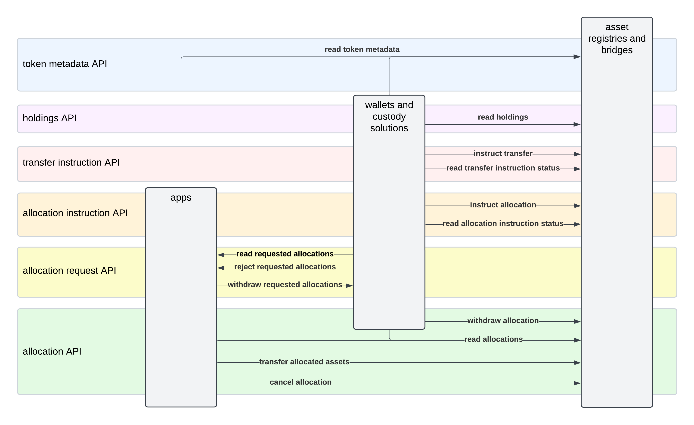

<pre>
  CIP:  CIP XXXX
  Layer: Daml
  Title: Canton Network Token Standard
  Author: Simon Meier, Matteo Limberto, Moritz Kiefer
  License: CC-1.0
  Status: Draft
  Type: Standards Track
  Created: 2025-03-07
  Post-History: https://lists.sync.global/g/cip-discuss/topic/110627661#msg13
</pre>

## Abstract

TODO

> Currently, featured applications can only generate activity records
> and mint rewards as part of Canton Coin transfers. However, this
> excludes a significant amount of applications that do not inherently involve Canton Coin.
> To address this problem and allow rewarding applications that do not
> involve Canton Coin, we propose introducing the ability for featured applications to create
> app activity markers without transfering Canton Coin. An app activity
> marker is equivalent to the existing app activity records created as
> part of a Canton Coin transfer recording a fixed amount of burned CC. The value of this marker
> will be determined by a new governance parameter.

## Copyright

This CIP is licensed under CC0-1.0: [Creative Commons CC0 1.0 Universal](https://creativecommons.org/publicdomain/zero/1.0/)

## Motivation

Define standard APIs for Canton Network tokens so that wallets and apps can use
them and build on them in a uniform way.

## Specification

### Overview

This standard is concerned with three kinds of applications:

- **asset registries**:
  which are used to manage the ownership records of Canton Network
  tokens. For example, Amulet as the app backing Canton Coin, or Digital Asset’s
  tokenization utility backing USYC on Canton.

- **wallets and custody solutions**:
  which are used by investors to manage their Canton Network token holdings
  across multiple asset registries. For example, DFNS, Copper, HydraX, or future
  retail oriented wallets.

- **apps**: any other services which interact with tokenized assets on-chain.

The standard enables building wallets that provide the following functionality to investors:

1. **Portfolio view**:
   Display current and past holdings of all their Canton Network assets together
   with the total supply of the assets as reported by their registries.
2. **Free of Payment (FOP) Transfers**:
   Initiate bilateral, free-of-payment transfers of their holdings; and monitor
   their progress.
3. **Delivery versus Payment (DVP) Transfers**:
   Review, approve and reject asset transfers requested by apps to atomically settle on-ledger DVP obligations.

The support for DVP transfers enables building apps that coordinate asset
transfers as part of their workflows: e.g., margin management, OTC trading,
(decentralized) exchanges, or apps that accept Canton Network tokens as a means
of payment.

The standard is designed to enable the tokenization of Real-World Assets (RWAs) on Canton Network.
For this purpose it supports:

- **privacy**: information about asset holdings and transfers is shared on a need-to-know basis
- **control**: registries have full control over the workflows governing asset holdings and transfers

In the following, we provide a more detailed overview over the different
functionatlities supported by the standard.

#### UTXO Access Management

Note that Canton manages the state of its ledger using an extended Unspent-Transaction-Output (UTXO) model.
There is a one-to-one correspondence between Daml contracts and UTXOs.
Canton's UTXOs are annotated with their stakeholders and are only distributed to the nodes hosting these stakeholders.

Constructing transactions requires access to all UTXOs referenced or consumed by the transaction.
Clients provide this access by retrieving the UTXOs known to their parties from their validator node and
the UTXOs known to an app provider using API calls to app-specific services.

The standard proposes to provide UTXO access for constructing transactions involving tokens as follows:

- **wallet access to user parties**:
  wallets are assumed to have access to the Ledger API of the validator node hosting the parties of their users
  and use that to retrieve all UTXOs known to these parties.
- **registry off-ledger APIs**:
  registries serve UTXOs private to the registry via standardized HTTP APIs specified using OpenAPI as part of the standard.

#### Free of Payment (FOP) Transfer Workflow

The FOP transfer workflow supported by the standard enables an investor to send a
specific amount of their asset holdings to another investor, which is considered
the recipient of the transfer.

The transfer is always initiated by the sender using their wallet to submit a
Daml transaction that specifies the instruction to the registry to execute the
transfer within a given deadline. Depending on the registry, this instruction
gets completed immediately as part of this one Daml transaction; or once
further registry-specific steps have happened as part of additional Daml transactions.

The latter option is provided for registries that require additional approvals
to be provided before a transfer can be executed; or registries whose authoritative
ledger is maintained outside of Canton. Registries are allowed to abort a
transfer instruction in case the transfer is not possible.

#### Delivery versus Payment (DVP) Transfer Workflows

The DVP transfer workflows enable multiple asset transfers to be executed as
part of a single Daml transaction in an all-or-nothing fashion: either all
transfers happen or none of them happens.

For this purpose, the registries allow investors to use their wallet to allocate
some of their asset holdings to a settlement for a fixed amount of time. Once
all allocations required for a settlement are present, the settlement executor
submits the one Daml transaction that triggers all of the transfers.

More concretely, the standard specifies APIs that enable apps and wallets to
support the workflows along the following lines:

1. The user uses the app to get to a point where they are required to deliver
   some of their assets as part of a settlement. For example, they made a
   matched bid on an exchange app or they requested to purchase a license in
   exchange for some of their asset holdings.
2. The user sees the requested asset allocation for that settlement in their wallet
   and use the wallet to create the Daml transaction that instructs the registry
   to create a corresponding allocation.
3. The app's backend observes the creation of the allocation on its validator node.
   It checks whether all allocations for the settlement have been created, and if yes,
   then the app backend submits the transaction that completes the settlement, which
   includes the execution of all transfers of the allocated assets.

All settlements specify a deadline, and allocations are only valid until that deadline.
Thus the asset holdings are only locked to an allocation until that deadline, and
become available again to their owner immediately thereafter.

It is up to the apps to decide how to deal with settlements that fail to complete within
their deadline. They may just retry them, or they may also implement punitive actions
for the trading parties that failed to allocate their assets within time.

Analogously to transfer instructions, asset registries are allowed to use multi-step
workflows to process an allocation instruction into an actual allocation. They can
use that for example to check internal risk systems or to earmark the allocated funds
in an authoriative ledger maintained outside of Canton.

#### Wallet Client / Portfolio View

As one can see from the sections above, a user's wallet serves a central role in
the transfer workflows. The user is expected to configure their wallet client
such that it can get real-time access to their asset holdings and in-progress
transfers using the Ledger API of a validator node hosting the user's Daml parties.
The wallet client can use this access to populate a portfolio view of all of the
user's assets and the in-progress workflows on them.

The wallet client can also use that Ledger API access to prepare Daml transactions
that match a user's desired action: e.g., creating a FOP transfer instruction.
It is the user's choice whether to sign these transactions off-ledger or have them
be signed by their validator node. Registries should aim to allow for up to 24 hours
between the preparation of such a transaction and their submission to the network.

##### Registry Specific Data and UIs

The standard further defines an interface that allows registries to communicate
an HTTP endpoint to wallet clients from which the wallet client can retrieve
registry-wide information about a token, i.e., its name, total supply, token
symbol, and an optional URL at which a registry-specific UI is available.

The URL for the registry-specific UI could for example be used for the user
to ask for the redemption of a wrapped token to a specific address on the
original chain/ledger. Providing this URL allows universal wallet clients
to handle all steps of common workflows, while allowing registries to
implement custom workflows where required.

Furthermore, registries that do not use Canton as the authoritative ledger
might decide to not represent holdings on Canton. This is still valuable,
as these assets can be used in DVP workflows like any other asset.
The wallet clients would show real-time information about all in-progress transfers.
Instead of showing the holdings they would though show a redirect to the registries
own UI for querying the holding balance.

The standard does not define an interface to query the holdings of such registries
from a Canton wallet client, as that would require standardizing how to authenticate
such a call.

#### Canton Coin Implementation

Canton Coin (CC) implements all APIs of the standard.
FOP transfers of CC are completed as part of the single Daml transaction instructing them.
Likewise, DVP allocations of CC are created within a single Daml transaction instructing them.

CC is standards compliant except for the following two limitations:

- *shorter submission delay*: the CC implementation only supports a 1 minute
  delay between preparing a transaction and submitting it to the network.
  This is in contrast to the 24h delay targeted by the standard.
- *no holding fees in portfolio view*: the amounts of CC holdings always show
  the amount as of the round that they were created in. Wallets cannot
  use the standardized APIs to display holding fees for CC holdings, but they
  can read the `Amulet` contracts themselves if they desire to show holding fees.

TODO: create issue for removing the two metadata keys once we're sold on not having them

Both of these limitations are expected to be removed in the future, as
explained in [Canton Coin Limitations](#canton-coin-limitations).

#### Metadata

The standard employs metadata records to enable transporting additional data as
part of the standardized workflows. These metadata records are text-based
key-value maps. Concretely, they are present on

- choice arguments: for the caller to provide extra context information,
  e.g., the reason for withdrawing an allocation
- choice results: for the implementation to provide extra information about choice execution,
  e.g., the fees charged
- interface views: for the implementation to provide extra information about the contract,
  e.g., an associated account-id
- data records: to associate extra information throughout workflow with that data record
  e.g., an off-ledger correlation id for the trade that is being settled

App implementors, standard proposals, and standards are free to define metadata
keys provided they prefix them with a DNS hostname that uniquely identifies the
organization defining the key, thereby avoiding clashes between keys from
different organizations.

For example, keys defined as part of [splice](https://github.com/hyperledger-labs/splice) are prefixed with
`splice.lfdecentralizedtrust.org/`.

This approach enables new metadata keys to be introduced both in a top-down fashion
by defining their meaning as part of new CIPs, as well as in a bottom-up fashion
by keys being defined ad-hoc and adopted more widely purely based on their usefulness.

TODO: define the metadata keys used by the standard
- the URL of the registry UI

### Details

The standard defines six APIs. Each consists of an on-ledger Daml API and
optionally an off-ledger HTTP API. The six APIs and their purpose are:

- token metadata API: serve symbol name, total supply, URL for registry-specific UI, other metadata
- holdings API: populate portfolio view
- transfer instruction API: initiate and monitor FOP transfers
- allocation API: allocate assets to execute DVP transfers
- allocation request API: uniform way for apps to request allocations
- allocation instruction API: uniform way for wallets to create allocations

A draft PR with all Daml and OpenAPI definitions for all six APIs is linked
below in the [Reference implementation](#reference-implementation) section. Daml
APIs are specified using Daml interfaces and HTTP APIs are specified using
OpenAPI.

The following diagram provides an overview of the interactions enabled by these
APIs.

#### Implementation Requirements

The code in the [Reference implementation](#reference-implementation) provides
the exact definitions of the APIs together with inline comments specifying the
exact contracts between API clients and implementors.

Asset registries can in principle freely choose which of the five APIs
concerning them they want to implement. However, the should implement all five
of them to maximize the utility of their tokens. The exception are asset
registries whose authoritative holdings records are not maintained on Canton.
They may decide to not implement the "holdings API" to avoid stale holding
records on Canton.

Wallets and custody solutions should aim to make use of all six APIs to provide
a uniform UX across all Canton Network tokens. They should query a registry's
metadata to figure out which APIs it supports and adjust their UI accordingly.

Apps may use the "allocation API" to orchestrate asset transfers as part of
their own workflows. They may also implement the "allocation request API"
to integrate with wallets in a uniform way.

#### Transaction History

The standard aims to enable wallets to provide a transaction history view that explains
all changes to a users' portfolio view and the view of in-progress transfers.

The standard APIs thus define choices for all actions taken by registries,
wallets, or apps on user-visible contracts that implement the `Holding`,
`TransferInstruction`, `AllocationInstruction`, `AllocationRequest`, or
`Allocation` interface. Thereby enabling wallets to parse the transaction history
in an implementation-agnostic way using an interface filter to subscribe
to the transaction tree stream served on the Ledger API of the validator node
hosting the user's Daml parties.

#### Access to Registry Off-Ledger APIs

The standard expects registry apps to expose the standard's HTTP endpoints for
accessing UTXOs to the public internet to provide maximal freedom for wallets
and apps to fetch these.

The standard does not require these requests to be authenticated, as all of them
either access data that is expected to be public (e.g., registry metadata) or
data that is protected by a difficult to guess identifier (e.g., the contract-id
of an allocation). See [this section](#no-authentication-on-registry-off-ledger-apis)
for the rationale.

## Rationale

### Alternatives considered

- future: publish non-user specific URL via party metadata on Canton Name Service
“cn-token-metadata.standard.sync.global/registryUrl -> https://registry.acme.com/api/cn-token-registry/”

- reading/shipping all data on-ledger

### Relation to ERC20

This standard is inspired by the [ERC20 standard](https://eips.ethereum.org/EIPS/eip-20),
and covers all but the "allowance" feature of ERC20. More precisely:

- token metadata API: covers the ERC20 functions `name()`, `symbol()`, `decimals()`, `totalSupply()`
- holdings API: covers the functions `balanceOf(...)` via
  on-ledger read from validator node hosting the invstors parties
- transfer instruction API: covers the function `transfer(...)` for transactions doing a single transfer
- allocation APIs: cover the the atomic execution of multiple `transfer(..)` function calls in the same
  transaction. They thus provide fine-grained control over `approve(...)` and `allowance(...)` for settlement.
- interface filters
  ([proto](https://github.com/digital-asset/canton/blob/b7bad9cce18ae9184ee67d7acb3237589e5bccec/community/ledger-api/src/main/protobuf/com/daml/ledger/api/v2/transaction_filter.proto#L58-L76))
  on the Ledger API for the choices from these APIs cover the ERC20 `Transfer`
  and `Approval` events via the transaction trees stream
  ([proto](https://github.com/digital-asset/canton/blob/b7bad9cce18ae9184ee67d7acb3237589e5bccec/community/ledger-api/src/main/protobuf/com/daml/ledger/api/v2/update_service.proto#L38-L42))
  on validator nodes

This CIP does no standardize an allowance API for two reasons:

1. Allocations seem to cover the majority of use-cases for allowance.
2. Allowances as structured in ERC20 do not work well with a UTXO model and privacy:
   the third-party is neither privy to the UTXOs that they could spend nor would
   they know which ones they can use without causing undue contention with
   concurrent activity by the owner or other parties with an allowance.

For this reason, the design of a UTXO-compatible allowance API is left to a future CIP.

### Canton Coin Limitations

As explained in [Canton Coin Implementation](#canton-coin-implementation),
the CC implementation of this CIP will come with two limitations:
a shorter tolerable submission delay and no generic support for wallets
to display holding fees.

There are two reasons for the shorter submission delay:

1. The `AmuletRules_Transfer` choice calls `getTime` to check that the
   round is open for recording transfers. These calls require the prepared
   transaction to pin the ledger time (see [Canton Time
   Model Docs](https://docs.daml.com/concepts/time.html)), which in turn limits the
   maximal record time up to which the transaction can be sequenced on the
   Global Synchronizer. The maximal skew between ledger time and record time
   allowed on the Global Synchronizer is 1 minute.
2. The `OpenMiningRound` contracts referenced in the `AmuletRules_Transfer`
   choice have a maximal life-time of 20 minutes, as that is the duration
   for which a round stays open for recording activity before it moves into
   the issuing phase. Thus any transaction referencing them becomes stale after
   20 minuts, as it refers to an archived contract (i.e., a spent UTXO).

The solution to both of these limitations is to restructure the activity recording
and CC issuance such that no round contracts are required at all. This can
be done by summarizing activity records for 10' intervals of ledger effective time
that are far enough in the past so that no new activity records can be created
within that interval.

Getting rid of round contracts also requires moving away from the round-based
holding fees that are currently charged. We expect to replace holding fees with
a time-based expiry of coins that depends on their amount: for example at
an expiry rate of $1 per year, a coin contract worth $100 could be archived
by any SV after 100 years. This solves for the problem of SVs not having to
store dust-coins forever without the complication of time-dependent holding balances.

The CIP accepts the current CC limitations, as these two changes are non-trivial
pieces of work that we we didn't want to put on the critical path of
establishing a Canton Network token standard.

Furthermore, existing wallets already do have direct integrations with
[CC-specific FOP
workflows](https://docs.dev.sync.global/app_dev/validator_api/index.html#external-custody-api)
that allow for a 24h submission delay.

### No Authentication on Registry Off-Ledger APIs

We believe that most tokenization use-cases can be implemented securely with
the protections in place in the current standard. The main protection being that
sensitive data like an investors holdings and in-progress transfers can only be
queried from the investors validator node. The secondary protection being that
accessing sensitive data like the details of a transfer instruction via the
off-ledger registry API requires knowing the corresponding contract-id, which is
a hash over these details and high entropy data. Data that can only be guessed,
if at all, for parties that are part of the transaction creating the
contract-id.

This CIP thus does not standardize an authentication scheme for the off-ledger APIs
of registries to accelerate the delivery of the first version of the Canton
Network token standard. We expect that an authentication scheme can and will be
standardized once there is sufficient demand for it.

## Backwards compatiblity

The changes in this CIP are fully backwards compatible.

Existing apps can support the APIs by adding corresponding interface
implementations to their templates as part of a smart-contract upgrade.
Analogously to what the reference implementation does to make CC support the
token standard.

## Reference implementation

A reference implementation of the Daml interfaces and the OpenAPI specifications
can be found in the `token-standard/` directory in the `splice` repository on the
[`canton-3.3` branch](https://github.com/hyperledger-labs/splice/tree/canton-3.3/token-standard#readme).
The same branch also contains the `Amulet` implementation of the token standard APIs.

## Copyright

This CIP is licensed under CC-1.0.

## Changelog

2025-03-11 - Intial Draft
